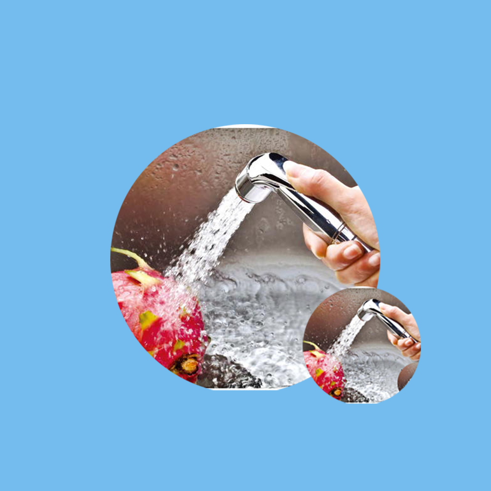

## 欢迎来到 家庭每日用水记录工具

在我们日常生活中，经常会用到水资源。例如我们家庭每天需要用水清洗蔬菜，洗衣服，拖地，厨房用水等。合理利用水不但可以节约用水，还能环保。我们可以利用这款应用，记录每天用水的情况，水的用途，使用了多少升的水等信息。我们还可以记录家庭人员的用水偏好和节约用水的方式，帮助我们养成节约用水的好习惯，减少水资源的浪费。

如果您遇到什么需要解答的问题，请发送您的问题到以下邮箱。

我们将第一时间为您解答。

### 邮箱地址: zhanghesongyuan7@126.com

谢谢！
